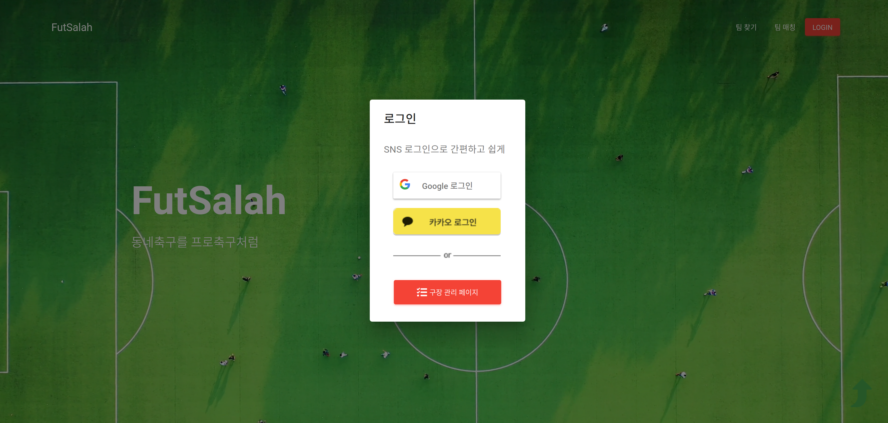
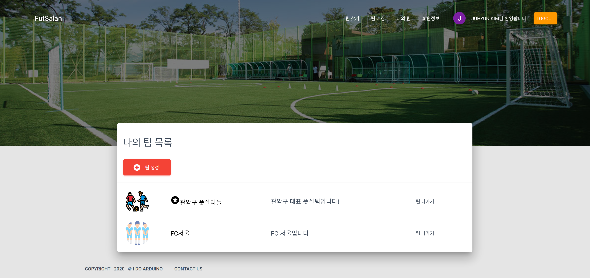
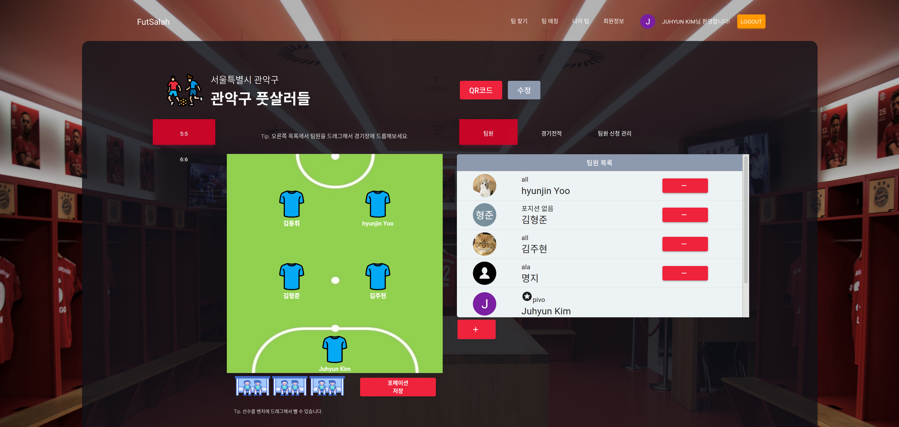
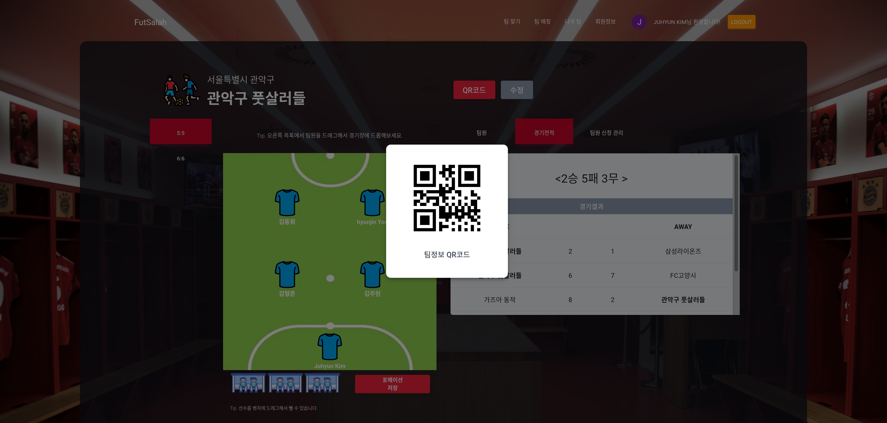
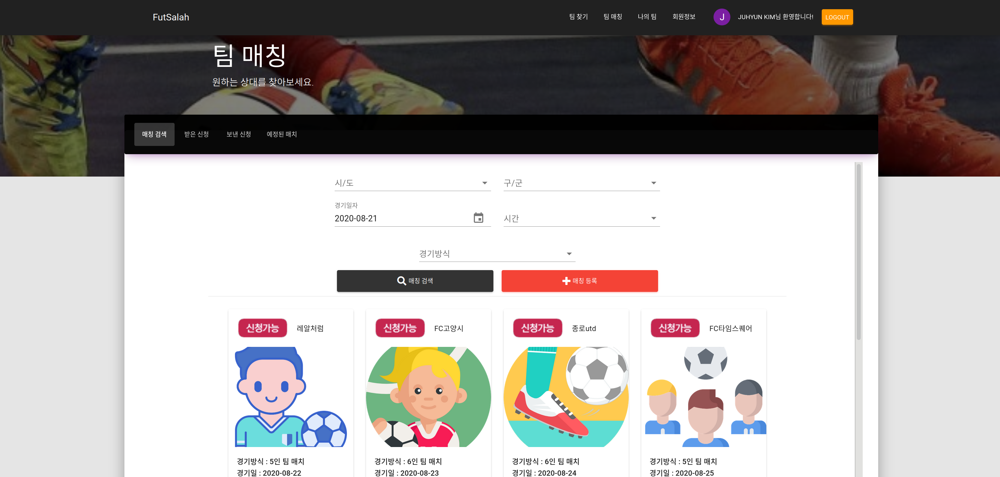
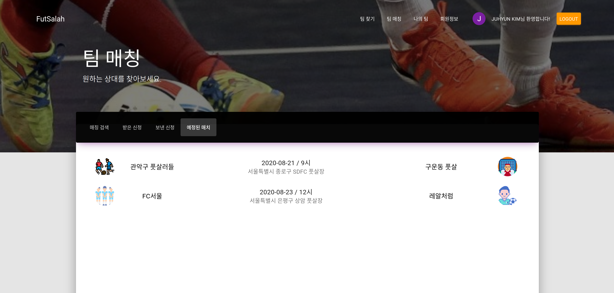
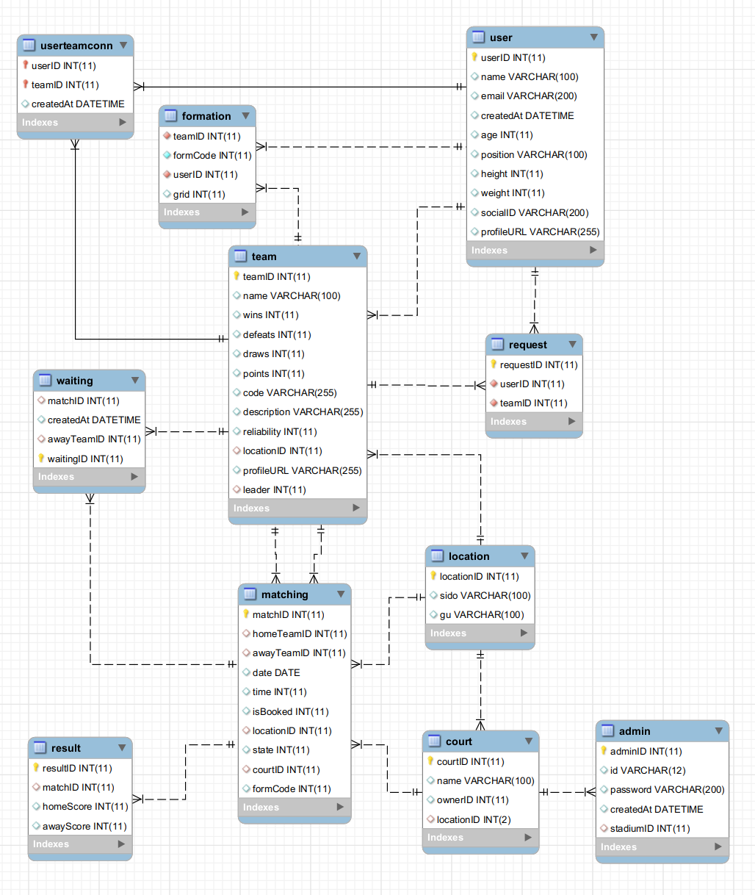
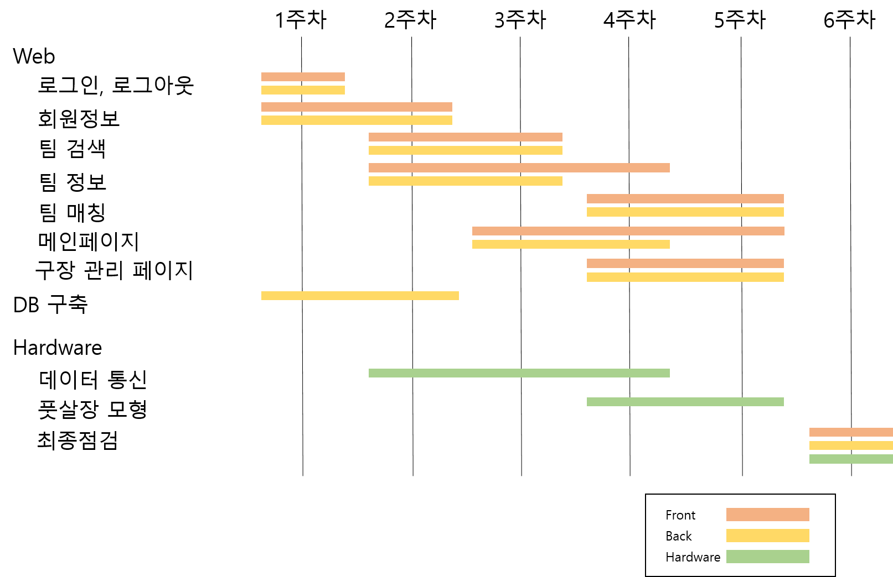

<h1 align="center">Welcome to FutSalah 👋</h1>
<p>
  <a href="#" target="_blank">
    
  </a>
  <a href="https://lab.ssafy.com/s03-webmobile3-sub3/s03p13a112/blob/master/LICENSE" target="_blank">
    
  </a>
</p>

> SSAFY 3기 2학기 1반 12팀 - `I do Arduino` 의 프로젝트 저장소

<br>

### 🏠 [Explore FutSalah](http://i3a112.p.ssafy.io/)

<br>

## :page_with_curl: ​Description

> 동네축구를 프로축구처럼

<br>

### 개요

- 기존에 풋살과 관련 서비스 존재하지만 서비스 이용에 **불편한 점**들이 있어 자주 사용을 하지 않는다
- 기존 서비스들의 불편한 점들을 **개선**하고, 라즈베리 파이를 이용한 경기 점수에 **투명성**을 보장하여 이용자들이 좀 더 **편리**하게 사용할 수 있는 사이트 구축을 위한 프로젝트

<br>

### Futsalah vs 기존 서비스 

1. 매칭 등록시 일정한 폼이 존재하여 이용하기 간편하다
2. **랭킹 서비스**를 이용하여 상대팀의 실력을 알 수 있다
3. 팀과 팀원 **관리**가 **용이**하다
4. `Raspberry Pi` 를 활용한 스마트 구장에서 경기한다는 전제 하에 제공하는 서비스 임으로 경기 결과, 출결 등을 바탕으로 **객관적인 신뢰도 서비스**를 제공한다
5. **Formation** 제도를 통해 팀원들의 주요 formation을 알 수 있으며, 전 경기들에 대한 정보들을 제공함으로써 팀에 대한 **상세 정보**를 보다 **간편**하고 **정확**하게 제공한다

<br>

<br>

## :mag: Overview

<br>

### Main page


<br>

### Signin with Social account



<br>

### My Team



<br>

### Team Info.



<br>

### Team QR Code



<br>

### Match



<br>

### Upcoming Matches




<br>

<br>

## :wrench: ​Tech Stack


### Backend

- SpringBoot  `2.3.1`

### Frontend

- React  `16.13.1`

### DB

- MySQL  `5.7.31`

### SCM

- Git  `2.17.1`

<br>
<br>

## :pencil2: ERD




<br>

<br>

## :runner: Steps to run

### Backend

```bash
$ cd backend
$ mvn package
$ cd target
$ java -jar backend-0.0.1-SNAPSHOT.jar
```

### Frontend

```bash
$ cd frontend
$ yarn install 
$ yarn start
```

<br>

<br>

## 👤 Author 

:information_desk_person: ​[김주현](https://github.com/chloe-codes1) - `팀장`  Backend, DevOps

🙋‍♂️ [권혁규](https://github.com/klw940) - `CTO`  Frontend

:raising_hand: ​[유현진](https://github.com/guswls) - Backend

🙆‍♂️ [김형준](https://github.com/hyungjun268) - Frontend

💁‍♂️ [김경훈](https://github.com/oogg7754) - IoT, Frontend

🙋‍♂️ [김동휘](https://github.com/wheeking) - IoT, Frontend

<br>

<br>

## :bulb: ​Wiki 

- [Git 협업 스타일](/docs/Git_협업_스타일.md)

<br>

<br>

## :date: ​Timeline

> 개발 기간: 7/20/2020 ~ 8/21/2020

<br>




<br>

### 7/20 (월)

> [기록](/docs/0720_주제선정.md)

- [x] : 주제 선정
- [x] : 기술 스택 선정
- [x] : 개발 환경 세팅

<br>

### 7/21 (화)

> [기록](/docs/0721_기능_세분화.md)

- [x] : 프로젝트 상세 기획

- [x] : 기능 세분화

<br>

### 7/22 (수)

- [x] : DB 설계

<br>
<br>

## 🧚‍♀️ Environment variables 

- 환경 설정 파일 추가하기

  - `.env` 파일을 frontend folder의 root에 추가한다

  ex) 

  ```bash
  PORT= // client port
  REACT_APP_SERVER_BASE_URL=  // server url
  REACT_APP_S3_BASE_URL=  // s3 url
  ```

- 사용법
  
  - `process.env.REACT_APP_{env_var_name}`

<br>

<br>

## 📝 License

Copyright © 2020  I do Arduino <br />
This project is [MIT](https://lab.ssafy.com/s03-webmobile3-sub3/s03p13a112/blob/master/LICENSE) licensed.